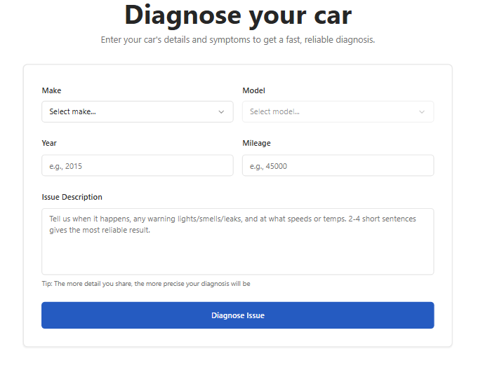
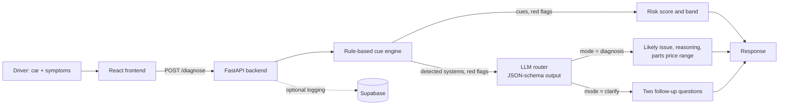

# Whipify

**AI car diagnostics for everyday drivers.** Describe what your car is doing in plain English and Whipify tells you the most likely issue, how risky it is to keep driving, and a typical price range for the parts, or asks two targeted follow-up questions when the description isn't enough to be confident.

<p align="center">
  
</p>

Pick your car's make and model, add the year and mileage, describe what's happening in a few sentences (when it happens, any warning lights, smells, leaks or noises), and click **Diagnose Issue**.

**Try it online:** [whipify.it.com](https://whipify.it.com). Sign up on the landing page to get 3 free diagnoses. The hosted beta runs on free tiers, so if no one has used it recently, your first sign-up can take a minute or two while the server wakes up, so give it a moment. If sign-up or diagnosis still doesn't work, the hosted version is no longer available, but you can [run it locally](#run-it-locally) in a few minutes.

<!-- TODO: add demo GIF here, e.g.  -->

## How it works

Whipify combines a deterministic rule engine with an LLM, so safety-relevant signals never depend on the model alone.



1. **Cue detection.** The symptom text is scanned against a library of trigger phrases (for example "grinding when braking", "temp light", "sweet smell"). Each cue maps to a vehicle system, a weight, candidate issues, and whether it is a red flag.
2. **Risk scoring.** Cue weights, plus a boost for red flags, go through a logistic function to give a 0–1 risk score, mapped to four bands: **Green** (safe to drive), **Yellow**, **Orange** and **Red** (don't drive). With no cues detected the score sits at 0.5 (Yellow, "get it checked"). This part is deterministic and explainable.
3. **LLM routing.** The model receives the vehicle, the symptoms and the rule engine's findings, and must choose one of two modes, enforced with a JSON schema (structured outputs):
   - `diagnosis`: one specific likely issue, a mechanic-style explanation, and an aftermarket parts price range;
   - `clarify`: exactly two questions a non-expert driver can answer.
4. **Guardrails.** Every model response is validated; malformed output, API errors or a missing key fall back to safe generic follow-up questions instead of failing. Clarifying questions don't use up one of the user's diagnoses.

## Features

- Two-step diagnose-or-clarify flow with structured LLM output and validation
- Rule-based risk bands that keep red flags (overheating, metal-on-metal braking) consistent regardless of model output
- Beta access system: sign-up issues an access token, exchanged for an HTTP-only session cookie; each account gets 3 diagnoses over 7 days
- Per-IP rate limiting on every endpoint (slowapi)
- Optional logging of sessions, messages, detected cues and diagnoses to Supabase (row-level security enabled, server-side writes only)

## Tech stack

| Layer | Tools |
|---|---|
| Frontend | React, TypeScript, Vite, Tailwind CSS, shadcn/ui, react-hook-form + zod |
| Backend | Python, FastAPI, Pydantic, httpx, slowapi |
| AI | OpenAI Chat Completions with JSON-schema structured outputs (model configurable, default `gpt-4o-mini`) |
| Data | SQLite (beta users, tokens), Supabase Postgres (diagnosis logs, optional) |
| Hosting (during beta) | Vercel (frontend), Render (API), Supabase |

## Run it locally

Requirements: Python 3.11+, Node 18+, and an OpenAI API key. Supabase is optional.

**1. Backend**

```bash
cd backend
python -m venv .venv
source .venv/bin/activate        # Windows: .venv\Scripts\activate
pip install -r requirements.txt
cp .env.example .env             # then add your OPENAI_API_KEY
uvicorn app.main:app --reload --port 8000
```

Check it's running at http://localhost:8000/health. Interactive API docs are at http://localhost:8000/docs.

**2. Frontend** (in a second terminal)

```bash
cd frontend
npm install
cp .env.example .env             # VITE_API_BASE=http://localhost:8000
npm run dev
```

Open http://localhost:8080, sign up with any name and email (stored only in your local SQLite file), and run a diagnosis.

**Optional: Supabase logging.** Create a Supabase project, run [`backend/schema.sql`](backend/schema.sql) in its SQL editor, and set `SUPABASE_URL` and `SUPABASE_SERVICE_ROLE_KEY` in `backend/.env`. Without them, the API runs normally and simply skips logging.

## API

| Method | Endpoint | Purpose |
|---|---|---|
| GET | `/health` | Health check |
| POST | `/beta-signup` | Create a beta user and return an access token |
| POST | `/auth/exchange-token` | Exchange the token for an HTTP-only session cookie |
| POST | `/validate-token` | Return the current user and diagnoses remaining |
| POST | `/diagnose` | Run the cue engine + LLM; returns a diagnosis or two clarifying questions |
| POST | `/auth/logout` | Clear the session cookie |

Example `/diagnose` response for "grinding when braking":

```json
{
  "mode": "diagnosis",
  "risk_band": "Red",
  "drivable": false,
  "risk_score": 0.9,
  "likely_issue": "Brake pads worn down to the metal backing plate",
  "why": "Grinding when braking usually means the pads are worn through...",
  "price_estimate": { "parts_low": 30, "parts_high": 80, "notes": "Pads for one axle; rotors may also need replacing." },
  "diagnoses_remaining": 2
}
```

## Project structure

```
backend/
  app/main.py              API routes, cue library, risk scoring, LLM routing
  app/repo/beta_users.py   Beta users, access tokens, diagnosis limits (SQLite)
  app/repo/diagnostics.py  Session and diagnosis logging (Supabase, optional)
  schema.sql               Supabase tables for logging
frontend/
  src/pages/Index.tsx                 Session handling and page layout
  src/components/AccessForm.tsx       Beta sign-up
  src/components/DiagnosticForm.tsx   Vehicle + symptoms form, clarify flow
  src/components/DiagnosticResult.tsx Risk band, likely issue, price range
```

## Deployment history

Whipify ran as a hosted beta with the frontend on Vercel, the API on Render and logging in Supabase, alongside a separate marketing landing page at [whipify.it.com](https://whipify.it.com). The hosted version may be taken down at any time; the instructions above run the full app locally.

## Limitations and next steps

- The cue library is small (cooling and brakes) and matches exact phrases, so a paraphrase like "grinding noise when braking" misses the red flag and falls back to the neutral Yellow band. Embedding-based or LLM-assisted cue matching, and more systems, would strengthen the deterministic layer.
- Price ranges are model estimates of aftermarket parts costs, not quotes, and exclude labor.
- Next: an evaluation set of labeled symptom descriptions to benchmark models on accuracy, clarify rate, latency and cost, and a shop-booking flow after diagnosis.

## Author

Built by **Jaafar Ben Khaled**, [GitHub](https://github.com/JaafarBK02).

Licensed under the [MIT License](LICENSE).
